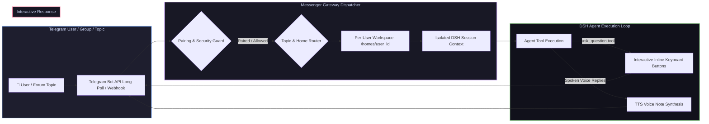

# 📦 @goodandready/dsh-messenger-gateway

<div align="center">

<h3>Dedicated Telegram Gateway with Interactive Button Steering, Forum Topics & Voice Replies for DeepSeek Harness</h3>

<p align="center">
  <a href="https://www.npmjs.com/package/@goodandready/dsh-messenger-gateway"></a>
  <a href="LICENSE"></a>
  <a href="https://github.com/topics/dsh-plugin"></a>
  <a href="https://nodejs.org"></a>
</p>

<p align="center">
  <a href="https://goodandready.app/"></a>
</p>

<p align="center">
  <a href="README.md"><b>🇬🇧 English</b></a> •
  <a href="README.ru.md"><b>🇷🇺 Русский</b></a> •
  <a href="README.zh.md"><b>🇨🇳 中文说明</b></a>
</p>

</div>

---

## ⚡ Overview

**`dsh-messenger-gateway`** delivers an enterprise-grade Telegram bridge for **DeepSeek Harness** agents. 

Beyond simple text forwarding, it bridges full agent interactivity into Telegram: **interactive steering buttons** for clarifying questions (`ask_question`), **Telegram Forum Topics** thread isolation, isolated **per-user home directories**, **one-time code pairing security**, and spoken **voice note replies (TTS)**.



---

## ✨ Key Features & Capabilities

### 1. 🎮 Interactive Agent Steering Buttons (`ask.js`)
When an agent calls `ask_question` with multiple choices, `dsh-messenger-gateway` renders native Telegram **Inline Keyboard Buttons**. The agent turn pauses safely, and execution resumes immediately upon the user tapping a choice.

### 2. 🧵 Telegram Forum Topics & Group Threads (`topics.js`, `groups.js`)
Full native support for Telegram Supergroup Forum Topics:
* Each Topic thread maps automatically to a dedicated DSH session;
* Contexts across topics never bleed into each other;
* Mention-only mode (`@bot_name`) or always-listen mode for group discussions.

### 3. 🔊 Spoken Voice Replies (TTS) (`tts.js`, `voice-prefs.js`)
Agents can reply directly with natural voice messages (`sendVoice`):
* Integration with [`dsh-tts`](https://github.com/GooDAnDReaDY/dsh-tts) or standalone TTS providers;
* Per-user `/voice on` and `/voice off` toggles.

### 4. 📁 Per-User Home Directory & Workspace Isolation (`homes.js`)
Each Telegram user is assigned a separate workspace directory (e.g. `workspaces/users/{userId}`):
* File operations, bash commands, and attachments stay strictly isolated;
* Prevents accidental file overwrites or unauthorized access to shared server files.

### 5. 🔐 6-Digit Pairing Code Security (`pairing.js`)
* Prevent unauthorized bot access: unknown users must input a one-time 6-digit pairing code generated in the DSH Web UI before they can interact with the agent;
* Admin whitelist mode (`allowedUsers`, `allowedChats`).

### 6. 🤖 Bot Commands & Management (`commands.js`)
* `/start` — Welcome message and pairing prompt;
* `/clear` — Resets current session history without deleting workspace files;
* `/voice [on|off]` — Toggles voice note synthesis;
* `/model` — Inspects or switches the active agent model;
* `/help` — Displays available capabilities.

---

## 📦 Quick Installation

```bash
dsh plugin --profile web add @goodandready/dsh-messenger-gateway
```

> [!IMPORTANT]
> Restart DSH after installation (`systemctl --user restart dsh-web`) and configure your `TELEGRAM_BOT_TOKEN`.

---

## ⚙️ Configuration Reference (`settings.yaml`)

```yaml
dsh-messenger-gateway:
  tokenEnv: TELEGRAM_BOT_TOKEN
  requirePairing: true
  enableVoiceReplies: true
  enableForumTopics: true
  homeBaseDir: data/workspaces/users
  allowedUsers: []
  allowedChats: []
```

---

## 📄 License

MIT © [GooDAnDReaDY](https://github.com/GooDAnDReaDY)
