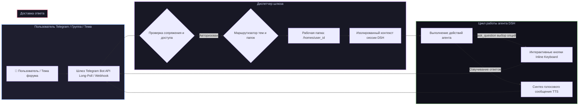

# 📦 @goodandready/dsh-messenger-gateway

<div align="center">

<h3>Шлюз Telegram с интерактивными кнопками управления, темами форумов и голосовыми ответами для DeepSeek Harness</h3>

<p align="center">
  <a href="https://www.npmjs.com/package/@goodandready/dsh-messenger-gateway"></a>
  <a href="LICENSE"></a>
  <a href="https://github.com/topics/dsh-plugin"></a>
  <a href="https://nodejs.org"></a>
</p>

<p align="center">
  <a href="https://goodandready.app/"></a>
</p>

<p align="center">
  <a href="README.md"><b>🇬🇧 English</b></a> •
  <a href="README.ru.md"><b>🇷🇺 Русский</b></a> •
  <a href="README.zh.md"><b>🇨🇳 中文说明</b></a>
</p>

</div>

---

## ⚡ Обзор

**`dsh-messenger-gateway`** предоставляет полнофункциональный Telegram-мост корпоративного уровня для агентов **DeepSeek Harness**.

В отличие от простых текстовых релеев, плагин переносит всю интерактивность агента прямо в Telegram: **интерактивные кнопки (Inline Keyboard)** для уточняющих вопросов (`ask_question`), изоляцию **тем форумов (Forum Topics)**, персональные **рабочие папки пользователей**, авторизацию по **6-значным кодам сопряжения** и голосовые **аудио-ответы (TTS)**.



---

## ✨ Ключевые возможности

### 1. 🎮 Интерактивные кнопки управления агентом (`ask.js`)
Когда агент вызывает инструмент `ask_question` со списком вариантов ответа, плагин отправляет нативные **Inline-кнопки** в Telegram. Ход агента безопасно приостанавливается, а при нажатии на кнопку выполнение мгновенно возобновляется.

### 2. 🧵 Темы форумов Telegram (Forum Topics) (`topics.js`, `groups.js`)
Полная поддержка тем в супергруппах Telegram:
* Каждая тема (Topic) автоматически привязывается к отдельной сессии DSH;
* Контексты разных тем не смешиваются между собой;
* Режим ответов по тегу (`@bot_name`) или постоянное прослушивание.

### 3. 🔊 Голосовые ответы ассистента (TTS) (`tts.js`, `voice-prefs.js`)
Агент может отвечать голосовыми сообщениями (`sendVoice`):
* Интеграция с [`dsh-tts`](https://github.com/GooDAnDReaDY/dsh-tts) или отдельными TTS-движками;
* Индивидуальное переключение пользователем через команды `/voice on` и `/voice off`.

### 4. 📁 Изоляция рабочих папок пользователей (`homes.js`)
Каждому пользователю Telegram выделяется отдельная изолированная директория на сервере (`workspaces/users/{userId}`):
* Файловые операции и запуск команд изолированы;
* Исключен риск перезаписи чужих файлов или доступа к системным ресурсам.

### 5. 🔐 Безопасность и 6-значные коды сопряжения (`pairing.js`)
* Защита от несанкционированного доступа: новые пользователи должны ввести одноразовый 6-значный код, сгенерированный в Web UI;
* Белые списки разрешенных ID (`allowedUsers`, `allowedChats`).

### 6. 🤖 Команды бота (`commands.js`)
* `/start` — приветствие и запуск сопряжения;
* `/clear` — сброс контекста текущего диалога без удаления рабочих файлов;
* `/voice [on|off]` — включение/отключение голосовых ответов;
* `/model` — просмотр и переключение активной модели агента;
* `/help` — список возможностей.

---

## 📦 Быстрая установка

```bash
dsh plugin --profile web add @goodandready/dsh-messenger-gateway
```

---

## ⚙️ Пример конфигурации (`settings.yaml`)

```yaml
dsh-messenger-gateway:
  tokenEnv: TELEGRAM_BOT_TOKEN
  requirePairing: true
  enableVoiceReplies: true
  enableForumTopics: true
  homeBaseDir: data/workspaces/users
  allowedUsers: []
  allowedChats: []
```

---

## 📄 Лицензия

MIT © [GooDAnDReaDY](https://github.com/GooDAnDReaDY)
