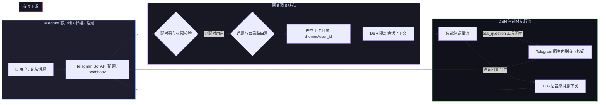

# 📦 @goodandready/dsh-messenger-gateway

<div align="center">

<h3>DeepSeek Harness Telegram 专属网关（支持交互按钮调度、论坛话题隔离与语音条回复）</h3>

<p align="center">
  <a href="https://www.npmjs.com/package/@goodandready/dsh-messenger-gateway"></a>
  <a href="LICENSE"></a>
  <a href="https://github.com/topics/dsh-plugin"></a>
  <a href="https://nodejs.org"></a>
</p>

<p align="center">
  <a href="https://goodandready.app/"></a>
</p>

<p align="center">
  <a href="README.md"><b>🇬🇧 English</b></a> •
  <a href="README.ru.md"><b>🇷🇺 Русский</b></a> •
  <a href="README.zh.md"><b>🇨🇳 中文说明</b></a>
</p>

</div>

---

## ⚡ 插件概览

**`dsh-messenger-gateway`** 为 **DeepSeek Harness** 智能体提供企业级 Telegram 接入桥梁。

除常规对话转发外，本插件全面打通了智能体深度交互能力：**问答交互式内联按钮 (Inline Keyboard)**、**Telegram 论坛话题 (Forum Topics) 独立会话隔离**、**单用户工作区目录安全隔离**、**6 位配对码鉴权防护**以及**语音条朗读回复 (TTS)**。



---

## 📦 安装指南

```bash
dsh plugin --profile web add @goodandready/dsh-messenger-gateway
```

---

## 📄 开源协议

MIT © [GooDAnDReaDY](https://github.com/GooDAnDReaDY)
